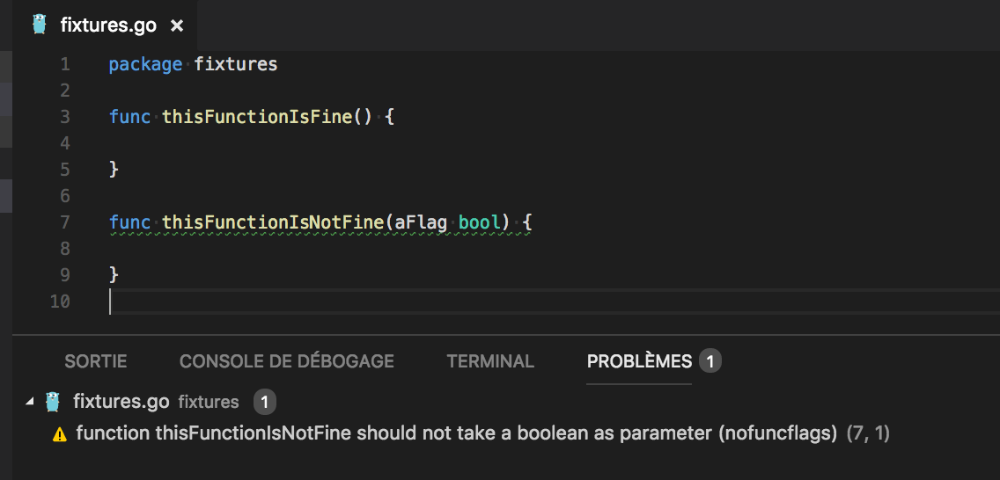

# Golang nofuncflags linter

« Flag arguments are ugly. Passing a boolean into a function is a truly terrible practice. It immediately complicates the signature of the method, loudly proclaiming that this function does more than one thing. It does one thing if the flag is true and another if the flag is false! »

*Clean Code - Robert C. Martin*



## Installation

`go get github.com/fsamin/nofuncflags``

### Usage

Any funcions containing a boolean as argument are extracted.

```shell
nofuncflags [<flags>] [<path>...]
```

### Usage with gometalinter

```shell
gometalinter --linter=nofuncflags:nofuncflags:PATH:LINE:COL:MESSAGE --enable=nofuncflags [<flags>] [<path>...]
```

Usage with Visual Studio Code
To use **nofuncflags** with VS Code you need to have Go Meta Linter installed, then add following to your User Settings (Ctrl+,)

```json
"go.lintTool": "gometalinter",
"go.lintFlags": [
  "--disable-all", // Disable all linters
  "--linter=nofuncflags:nofuncflags:PATH:LINE:COL:MESSAGE"
  "--enable=nofuncflags",
  "--enable=golint", // Enable any other linters you want to use
],
```